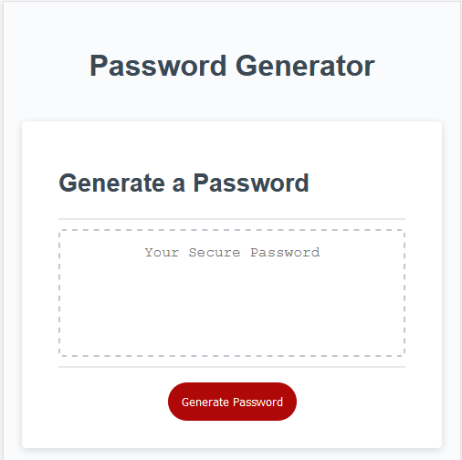
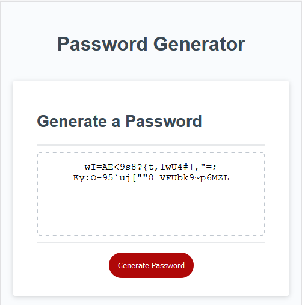
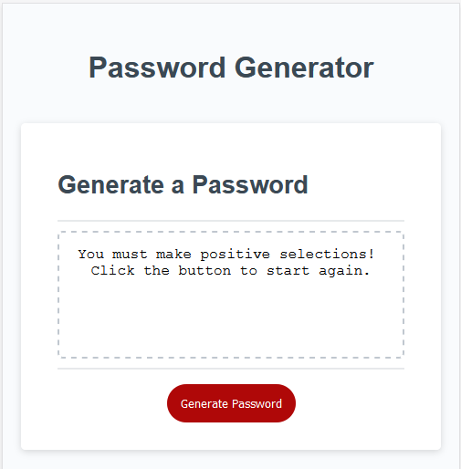
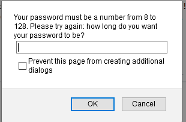

# Password Generator

## Purpose

This tool delivers a password of length from 8 to 128 characters long with optional character sets that may be included.

## Interaction Summary

The user is presented with a simple interaction: click the button to create a password. When clicked, the user is prompted for:
* The character length of the password
* If the user wants Lower-Case letters
* If the user wants Upper-Case letters
* If the user wants Numbers
* If the user wants Special Characters

If the user makes selections that go outside of the scope of this tool they are prompted to re-try and enter selections that fall within that scope (e.g. if they choose password legths outside of range 8 to 128 or fail to select "OK" on any of the character sets).

## Inner Functionaity

### Starting Point: Page Load
When the page loads, JavaScript creates a button then assigns an Event Listerner to that button. The associated function is called writePassword. It calls a function called generatePassword, takes the output of that function, and applies it to the DOM via QuerySelector on the #Password ID object.

### Action: Password Generator
When called, the password generator asks the user, via prompt for "number of characters".

A for loop within an if function detects if the user-selected Character Length is outside of range 8 to 128. Each loop it prompts for a new entry with relevant warning text. Until the user selects an appropriate entry the loop continues.

The function then asks, via confirm, for yes/no on each of the four possible character sets. A new array is created storing each of the prompt answers.

A for loop is initiated that, for each TRUE entry it references in the answers-array, it appends a cooresponding array of "possible character sets" to a new variable, "userPasswordpossibles". 

Once complete, the function runs an if to check that the user selected at least ONE character set, which it does by looking at the length of "userPasswordpossibles". It returns an error message if it's length less than 1.

Finally, once it passes each of these checks, Math.Random is applied in a for loop. The user-submitted character-length request determines the number of iterations. On each iteration, a new variable "password" is appended a random character from "userPassworddisplayed". Math.random is rounded to an integer and multiplied by the length of "userPasworddisplayed"; that number is used as the reference on charAt which is used to select a random, single character, at position random, from "userPassworddisplayed". 

Once the loop completes, the newly created password is returned to the function that calls it.

## Preview

**On-Load**

**Password Displayed**

**Character-Limit Failure**

**Character-Contents Failure**

### References

**Live URL:** [Password Generator](https://rasputinforever.github.io/Password-Generator/)
**Created By:** Erik Portillo, 11-21-2020
